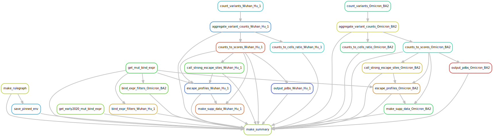

# Summary

Analysis run by [Snakefile](../../Snakefile)
using [this config file](../../config.yaml).
See the [README in the top directory](../../README.md)
for details.

Here is the rule graph of the computational workflow:

Here is the Markdown output of each notebook in the workflow:

1. Get prior RBD DMS mutation-level binding and expression measurements and barcode-variant lookup table from the [SARS-CoV-2-RBD_DMS_Omicron repository](https://github.com/jbloomlab/SARS-CoV-2-RBD_DMS_Omicron) and the original DMS library for SARS-CoV-2 (PCR-based mutagenesis) [here](https://github.com/jbloomlab/SARS-CoV-2-RBD_DMS). 

2. Count variants and then aggregate counts for
   [Wuhan_Hu_1](aggregate_variant_counts_Wuhan_Hu_1.md), 
   [Omicron_BA2](aggregate_variant_counts_Omicron_BA2.md)
   to create variant counts files for [Wuhan_Hu_1](../counts/Wuhan_Hu_1/variant_counts.csv.gz), and 
   [Omicron_BA2](../counts/Omicron_BA2/variant_counts.csv.gz).

3. Analyze sequencing counts to cells ratio for [Wuhan_Hu_1](counts_to_cells_ratio_Wuhan_Hu_1.md), 
   [Omicron_BA2](counts_to_cells_ratio_Omicron_BA2.md)
   this prints a list of any samples where this ratio too low. Also
   creates a CSV for [Wuhan_Hu_1](../counts/Wuhan_Hu_1/counts_to_cells_csv.csv), 
   [Omicron_BA2](../counts/Omicron_BA2/counts_to_cells_csv.csv) with the
   sequencing counts, number of sorted cells, and ratios for
   all samples.

4. Calculate escape scores from variant counts for [Wuhan_Hu_1](counts_to_scores_Wuhan_Hu_1.md), 
   [Omicron_BA2](counts_to_scores_Omicron_BA2.md).

5. Call sites of strong escape for [Wuhan_Hu_1](call_strong_escape_sites_Wuhan_Hu_1.md),
   [Omicron_BA2](call_strong_escape_sites_Omicron_BA2.md).

6. Plot escape profiles for [Wuhan_Hu_1](escape_profiles_Wuhan_Hu_1.md), 
   [Omicron_BA2](escape_profiles_Omicron_BA2.md).

7. Map escape profiles to ``*.pdb`` files using notebooks here for 
   [Wuhan_Hu_1](output_pdbs_Wuhan_Hu_1.md), 
   [Omicron_BA2](output_pdbs_Omicron_BA2.md).

8. Make supplementary data files for [Wuhan_Hu_1](make_supp_data_Wuhan_Hu_1.md), 
   [Omicron_BA2](make_supp_data_Omicron_BA2.md),
   which are here for [Wuhan_Hu_1](../supp_data/Wuhan_Hu_1), 
   [Omicron_BA2](../supp_data/Omicron_BA2). These include
   `dms-view` input files.